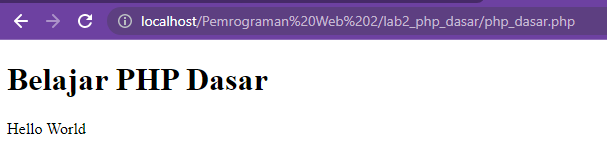

## Praktikum PHP Dasar

Nama : Laela Nur Rohmah
Nim : 312110425
Kelas : TI.21.A3

## 1. PHP DASAR

Buat file baru dengan nama php_dasar.php pada directory tersebut. Kemudian buat kode seperti berikut.

