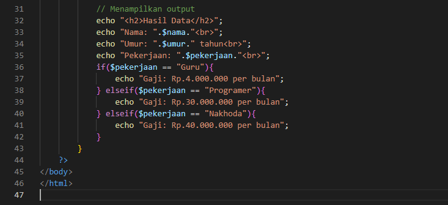

## Praktikum PHP Dasar

Nama : Laela Nur Rohmah
Nim : 312110425
Kelas : TI.21.A3

## 1. PHP DASAR

Buat file baru dengan nama php_dasar.php pada directory tersebut. Kemudian buat kode seperti berikut.

code:

Output:

## 2. Variable PHP

Menambahkan value kedalam variable

code:

.png)

Output:

## 3. Predefine Variable $_GET

mendapatkan value dengan menggunakan query 'nama'

code :

Output:

## 4. Membuat Form Input

mengirimkan value dengan menggunakan method post

code:

output:

.png)

## 5. Operator

code:

output:

## 6. Kondisi IF

code:

output:

## 7. Kondisi Switch

code:

output:

## 8. Perulangan For

code:

output:

## 9. Perulangan While

code:

output:

## 10. Perulangan do while

code:

output:

## 11. Praktikum

Buatlah program PHP sederhana dengan menggunakan form input yang menampilkan nama, umur(berdasarkan inputan tanggal lahir), dan pekerjaan.

code:

output:

